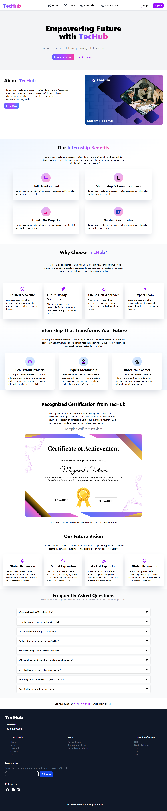
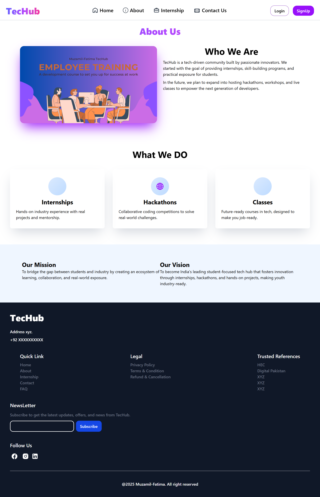
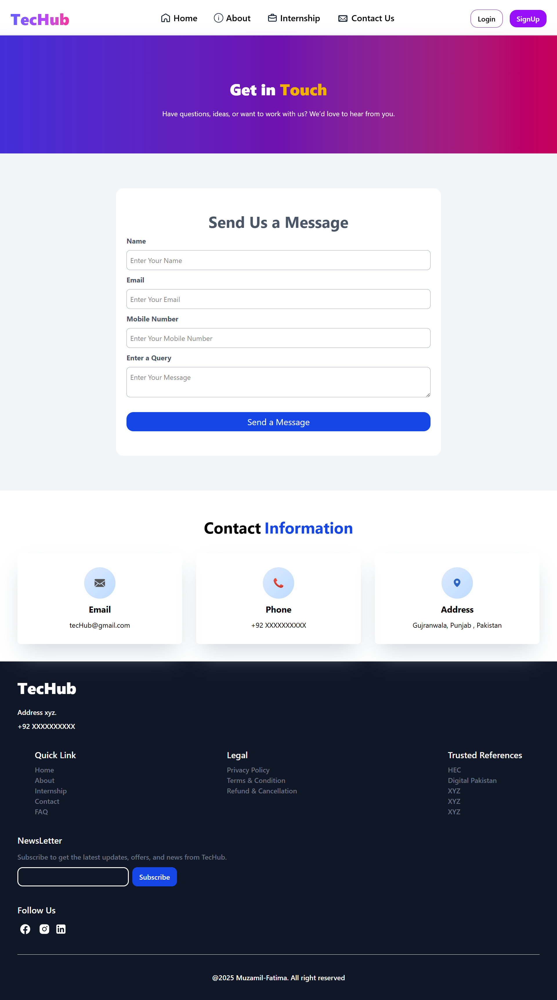

# 🌐 React Internship Platform

A modern and responsive **React.js web application** built using **React Router**, **Tailwind CSS**, and **React Hot Toast**.
This project includes user authentication pages, informational pages, and an internship opportunity section with a clean UI and smooth navigation.

---

## 🚀 Features

* ⚛️ Built with **React (Vite)**
* 🧭 **Client-side routing** using React Router
* 🔔 Toast notifications with **react-hot-toast**
* 🎨 Responsive UI with **Tailwind CSS**
* 🔐 Authentication pages (Login, Signup, Forgot Password, Email Verification)
* 📄 Informational pages (About, Contact)
* 💼 Internship / Opportunity page
* 🧩 Reusable components (Navbar & Footer)

---

## 📁 Project Structure

```
src/
│
├── Components/
│   ├── Navbar.jsx
│   └── Footer.jsx
│
├── pages/
│   ├── Home/
│   │   └── LandingPage.jsx
│   ├── About/
│   │   └── AboutUs.jsx
│   ├── ContactUs/
│   │   └── ContactInfo.jsx
│   ├── Internship/
│   │   └── Opportunity.jsx
│   └── Auth/
│       ├── Login.jsx
│       ├── SignUp.jsx
│       ├── Forget.jsx
│       ├── VerifyEmail.jsx
│       └── ResetPassword.jsx
│
├── App.jsx
└── main.jsx
```

---

## 🛣️ Routes Overview

| Route              | Page                     |
| ------------------ | ------------------------ |
| `/`                | Landing Page             |
| `/about`           | About Us                 |
| `/contact`         | Contact Information      |
| `/internship`      | Internship Opportunities |
| `/login`           | Login                    |
| `/signup`          | Sign Up                  |
| `/forget-password` | Forgot Password          |
| `/verify-email`    | Email Verification       |
| `/reset-password`  | Reset Password           |

---

## 🔔 Toast Notifications

Toast notifications are implemented using **react-hot-toast** with:

* Top-right position
* Custom dark theme
* Auto close after 4 seconds

---

## 🛠️ Tech Stack

* **Frontend:** React.js (Vite)
* **Routing:** React Router DOM
* **Styling:** Tailwind CSS
* **Notifications:** react-hot-toast

---

## ⚙️ Installation & Setup

1. **Clone the repository**

```bash
git clone https://github.com/Muzamil-Fatima/Tec_Hub.git
```

2. **Install dependencies**

```bash
npm install
```

3. **Run the development server**

```bash
npm run dev
```

4. Open your browser at:

```
http://localhost:5173
```

---

## 📌 Future Improvements

* Backend integration (Node.js + Express)
* JWT-based authentication
* Role-based access (Admin / User)
* Internship application system
* Dashboard for users

---
## Preview






---

## 👤 Author

<<<<<<< HEAD
**codixStack**
MERN Stack Developer
📌 Passionate about building real-world web applications
=======
**Muzamil**
Computer Science Student & MERN Stack Developer
📌 Passionate about building real-world web applications
>>>>>>> cc65fcec34579783f7610b01d8b0e755330a2a56
